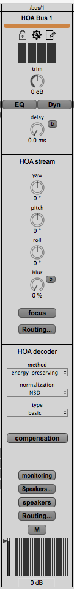

# General information

Scroll down to [Klangkupolen, Lilla Salen](#org62c4f61) for specifics

## Ambisonics in KMH studios and Lilla salen

### About ambisonics

The general idea behind using ambisonics for difusing sounds in a space is to, in the first stage, encode an audio signal to a representation of a sound field - a B-format signal. This B-format signal is idependent of whatever speaker array the signal will later be diffused on. In the second stage the B-format signal is decoded to the layout of a particular speaker array. In between these two stages a number of transformations may be applied, but the sound source specification may conveniently be specified in the encoder.

In principle, any kind of encoder may be combined with any kind of decoder provided that the same channel order is used. Among the encoders (VST) that work with the decoders presented here are [Ambix](http://www.matthiaskronlachner.com/?p=2015) and [IEM Plugin suite](https://plugins.iem.at/). Using these makes it simple to automate panning in a DAW such as [Reaper](https://www.reaper.fm/).

### About the compiled decoders

All decoders use ACN channel order (see [Component order](#orgec28b69)) and SN3D normalization (see [Normalisation](#org15c475d)) and are dual-band, max-rE/rV.

-   A guide to the file names

    For efficiency file names are composed of the following parts
    
    1.  The space (for Lilla Salen this is KMHLS\_AE)
    2.  Speaker configuration (Full or Normal where the former in 108/118 and 114 means the center speaker is included, and in Lilla Salen it refers to the 45.4 setup)
    3.  Order (e.g. 7H7P)
    4.  Redundant speaker configuration (full, but only in certain cases for Lilla Salen)
    5.  Finally, a number depicting the type of decoder according to the following codes:
    
    -   (1) AllRad mixed order (4/3)
    
        Mixed order ambisonics decoder.
    
    -   (2) Decoding with the pseudo-inverse, even-energy
    
        Pinv decoders in 1st, 3rd order with even-energy for inversion variants.
        
        The higher order decoders in pseudo-inverse do not work well, so do not try those above 3rd order.
    
    -   (3) Decoding with the pseudo-inverse, mode-matching
    
        Pinv decoders in 1st, 3rd order, mode-matching for inversion variants. This has been removed from the repository.
    
    -   (4) Same as (2) but with a blend coefficient for inversion variants (energy limited/mode matching 50%)
    
        1st and 3rd and 6th order.
        
        The higher order decoders in pseudo-inverse do not work well, so do not try those above 3rd order - though sixth order has provecd useful.
    
    -   (5) Spherical slepian decoders
    
        SSF decoders in 1st, 3rd and 6th order (6th order is here only as VST, but I can compile the other formats if needed.)
    
    -   (6) All-round decoders
    
        AllRAD decoders in 1st, 3rd, 5th and 7th order.

-   Ouput formats

    In the directory of each decoder there are four subdirectories:
    
    -   ambix: contains the decoder matrix for the ambix VST-plugin for certain settings.
    -   bin: contains all other decoders
    -   doc: documentation, a bare minimal (but a more comprehensive documentation can be built from the source, check the individual Makefiles for each compilere)
    -   src: the faust sources for the decoders
    
    The binaries are prepared in six different formats:
    
    1.  a jack application (start from commandline: $ KMHLS\_Dome\_4h3v\_normal\_1)
    2.  a double clickable CoreAudio application
    3.  a 'max' directory with Max/MSP objects (as package with help files to be put in ~/Documents/Max 7/Packages)
    4.  a 'pd' direcory (bang left most input to get parameter names)
    5.  a 'sc' directory with SuperCollider classes (put all .sc and .scx in ~/Library/Application Support/SuperCollider/Extensions , the supernova files are of course optional)
    6.  an 'ambix' directory with Ambix config file
    
    -   Install on your system
    
        You may simply move the decoders you want to use to the right locations on your system. They are compiled and ready to be used in the repository. As a convenience one may run the corresponding install scripts in the Makefile for the decoders to install them in your default directory:
        
        1.  Open a terminal (such as Terminal.app)
        2.  At the prompt type `$ cd` and drag one of the directories, say 'KMHLS\_AE\_normal\_6' of your downloaded repository onto the terminal and press enter.
        3.  Enter `$ make maxinstall` at the prompt and press enter.
        
        The last step can be made for `scinstall`, `vstinstall` and `pdinstall`
        
        Note that to create a Max/MSP compatible package you may have to run maxinstall and have the reslevant dependencies resolved. Else, contact me!

-   Component order

    The component order for the input to the decoder follows the ACN (Ambisonics Channel Number) standard according to the table below (for third order):
    
    <table border="2" cellspacing="0" cellpadding="6" rules="groups" frame="hsides">
    
    
    <colgroup>
    <col  class="org-left" />
    
    <col  class="org-right" />
    
    <col  class="org-right" />
    
    <col  class="org-right" />
    
    <col  class="org-right" />
    
    <col  class="org-right" />
    
    <col  class="org-left" />
    </colgroup>
    <tbody>
    <tr>
    <td class="org-left">&#xa0;</td>
    <td class="org-right">&#xa0;</td>
    <td class="org-right">&#xa0;</td>
    <td class="org-right">0</td>
    <td class="org-right">&#xa0;</td>
    <td class="org-right">&#xa0;</td>
    <td class="org-left">&#xa0;</td>
    </tr>
    
    
    <tr>
    <td class="org-left">&#xa0;</td>
    <td class="org-right">&#xa0;</td>
    <td class="org-right">1</td>
    <td class="org-right">2</td>
    <td class="org-right">3</td>
    <td class="org-right">&#xa0;</td>
    <td class="org-left">&#xa0;</td>
    </tr>
    
    
    <tr>
    <td class="org-left">&#xa0;</td>
    <td class="org-right">4</td>
    <td class="org-right">5</td>
    <td class="org-right">6</td>
    <td class="org-right">7</td>
    <td class="org-right">8</td>
    <td class="org-left">&#xa0;</td>
    </tr>
    
    
    <tr>
    <td class="org-left">9</td>
    <td class="org-right">10</td>
    <td class="org-right">11</td>
    <td class="org-right">12</td>
    <td class="org-right">13</td>
    <td class="org-right">13</td>
    <td class="org-left">15</td>
    </tr>
    </tbody>
    </table>
    
    Or: W Y Z X V T R S U Q O M K L N P 

-   Normalisation

    The decoder is using SN3D normalisation. With SN3D normalisation no component will exceed the peak value of the 0th order component.

-   Compiling the decoders

    This is only if you wish to tweak the settings in any way. All scripts needed for the compilation is in a speparate GitHub repository that may be found here: 
    In order to compile the decoders there are a number of dependencies that need to be resolved:
    
    -   ADT (Ambisoncs Decoder Toolkit)
    -   Faust
    -   VST SDK
    -   Pure Data
    -   Max MSP SDK
    -   Links to Supercollider classes
    
    -   Running Makefile scripts for ADT
    
        Run the following for each function that needs to be compiled for lilla salen (108\_all and 114\_all for the studios):
        
        `$ make ls_all function=6`
        
        Note that for fuction 2 & 4 only orders up to 3 are usable.
        
        The decoding matrices end up in a directory above your current directory named 'decoders'. Move into that directory with the following command:
        
        `$ cd ../decoders`
        
        With the decoding matrices calculated the binary decoders for all orders can be compiled by 
        
        `$ make -k target=all all`
        
        The target can be either of [all,sc,max,pd,vst]. Following this step the binaries can be installed (to install only one target, use that as the argument for 'target'.:
        
        `$ make -k target=install all`

# Klangkupolen, Lilla Salen

## Specific info for Klangkupolen

### Output

In Klangkupolen the channel order from the mixer is channel 1-29 for the regular dome. The lower ring starts at channel 33-48 and the subs are at 49-52. This is the reason that in the decoder the names for the sixteen floor speakers start at 33.

The layout is ordered clockwise starting at speaker one.

### Speaker positions

All distances and heigths are measured from 1.25m height from floor.

<table id="org92f7c7c" border="2" cellspacing="0" cellpadding="6" rules="groups" frame="hsides">

<colgroup>
<col  class="org-right" />

<col  class="org-right" />

<col  class="org-right" />

<col  class="org-right" />

<col  class="org-right" />
</colgroup>
<thead>
<tr>
<th scope="col" class="org-right">ndx</th>
<th scope="col" class="org-right">azimuth</th>
<th scope="col" class="org-right">elevation</th>
<th scope="col" class="org-right">distance</th>
<th scope="col" class="org-right">radius</th>
</tr>
</thead>

<tbody>
<tr>
<td class="org-right">1</td>
<td class="org-right">-34.689614</td>
<td class="org-right">12.910417</td>
<td class="org-right">4.61</td>
<td class="org-right">4.5789148</td>
</tr>

<tr>
<td class="org-right">2</td>
<td class="org-right">-13.383763</td>
<td class="org-right">12.910417</td>
<td class="org-right">4.61</td>
<td class="org-right">4.5577825</td>
</tr>

<tr>
<td class="org-right">3</td>
<td class="org-right">10.440725</td>
<td class="org-right">12.910417</td>
<td class="org-right">4.61</td>
<td class="org-right">4.5635592</td>
</tr>

<tr>
<td class="org-right">4</td>
<td class="org-right">32.117788</td>
<td class="org-right">12.910417</td>
<td class="org-right">4.61</td>
<td class="org-right">4.5386017</td>
</tr>

<tr>
<td class="org-right">5</td>
<td class="org-right">55.741675</td>
<td class="org-right">12.910417</td>
<td class="org-right">4.61</td>
<td class="org-right">4.4464181</td>
</tr>

<tr>
<td class="org-right">6</td>
<td class="org-right">78.207673</td>
<td class="org-right">12.910417</td>
<td class="org-right">4.61</td>
<td class="org-right">4.4723909</td>
</tr>

<tr>
<td class="org-right">7</td>
<td class="org-right">101.49442</td>
<td class="org-right">12.910417</td>
<td class="org-right">4.61</td>
<td class="org-right">4.4461719</td>
</tr>

<tr>
<td class="org-right">8</td>
<td class="org-right">124.85167</td>
<td class="org-right">12.910417</td>
<td class="org-right">4.61</td>
<td class="org-right">4.5148007</td>
</tr>

<tr>
<td class="org-right">9</td>
<td class="org-right">147.91193</td>
<td class="org-right">12.910417</td>
<td class="org-right">4.61</td>
<td class="org-right">4.5536496</td>
</tr>

<tr>
<td class="org-right">10</td>
<td class="org-right">169.17789</td>
<td class="org-right">12.910417</td>
<td class="org-right">4.61</td>
<td class="org-right">4.6069350</td>
</tr>

<tr>
<td class="org-right">11</td>
<td class="org-right">-167.82013</td>
<td class="org-right">12.910417</td>
<td class="org-right">4.61</td>
<td class="org-right">4.7018379</td>
</tr>

<tr>
<td class="org-right">12</td>
<td class="org-right">-145.63454</td>
<td class="org-right">12.910417</td>
<td class="org-right">4.61</td>
<td class="org-right">4.6822723</td>
</tr>

<tr>
<td class="org-right">13</td>
<td class="org-right">-123.78400</td>
<td class="org-right">12.910417</td>
<td class="org-right">4.61</td>
<td class="org-right">4.7368687</td>
</tr>

<tr>
<td class="org-right">14</td>
<td class="org-right">-102.64182</td>
<td class="org-right">12.910417</td>
<td class="org-right">4.61</td>
<td class="org-right">4.6743181</td>
</tr>

<tr>
<td class="org-right">15</td>
<td class="org-right">-79.887731</td>
<td class="org-right">12.910417</td>
<td class="org-right">4.61</td>
<td class="org-right">4.7101696</td>
</tr>

<tr>
<td class="org-right">16</td>
<td class="org-right">-57.926139</td>
<td class="org-right">12.910417</td>
<td class="org-right">4.61</td>
<td class="org-right">4.6119481</td>
</tr>

<tr>
<td class="org-right">17</td>
<td class="org-right">-22.349553</td>
<td class="org-right">34.696822</td>
<td class="org-right">4.882</td>
<td class="org-right">4.0761992</td>
</tr>

<tr>
<td class="org-right">18</td>
<td class="org-right">22.843958</td>
<td class="org-right">34.696822</td>
<td class="org-right">4.882</td>
<td class="org-right">3.7761827</td>
</tr>

<tr>
<td class="org-right">19</td>
<td class="org-right">69.013292</td>
<td class="org-right">34.696822</td>
<td class="org-right">4.882</td>
<td class="org-right">4.0485676</td>
</tr>

<tr>
<td class="org-right">20</td>
<td class="org-right">115.56544</td>
<td class="org-right">34.696822</td>
<td class="org-right">4.882</td>
<td class="org-right">4.1015729</td>
</tr>

<tr>
<td class="org-right">21</td>
<td class="org-right">158.89992</td>
<td class="org-right">34.696822</td>
<td class="org-right">4.882</td>
<td class="org-right">3.9444645</td>
</tr>

<tr>
<td class="org-right">22</td>
<td class="org-right">-158.89763</td>
<td class="org-right">34.696822</td>
<td class="org-right">4.882</td>
<td class="org-right">3.8051807</td>
</tr>

<tr>
<td class="org-right">23</td>
<td class="org-right">-114.65354</td>
<td class="org-right">34.696822</td>
<td class="org-right">4.882</td>
<td class="org-right">3.6199724</td>
</tr>

<tr>
<td class="org-right">24</td>
<td class="org-right">-68.170128</td>
<td class="org-right">34.696822</td>
<td class="org-right">4.882</td>
<td class="org-right">3.7380476</td>
</tr>

<tr>
<td class="org-right">25</td>
<td class="org-right">-45.</td>
<td class="org-right">69.185799</td>
<td class="org-right">5.317</td>
<td class="org-right">1.7225121</td>
</tr>

<tr>
<td class="org-right">26</td>
<td class="org-right">45.</td>
<td class="org-right">69.185799</td>
<td class="org-right">5.317</td>
<td class="org-right">1.7225121</td>
</tr>

<tr>
<td class="org-right">27</td>
<td class="org-right">135.</td>
<td class="org-right">69.185799</td>
<td class="org-right">5.317</td>
<td class="org-right">1.7225121</td>
</tr>

<tr>
<td class="org-right">28</td>
<td class="org-right">-135.</td>
<td class="org-right">69.185799</td>
<td class="org-right">5.317</td>
<td class="org-right">1.7225121</td>
</tr>

<tr>
<td class="org-right">29</td>
<td class="org-right">0.</td>
<td class="org-right">90.</td>
<td class="org-right">5.576</td>
<td class="org-right">0</td>
</tr>

<tr>
<td class="org-right">33</td>
<td class="org-right">-8.439614</td>
<td class="org-right">-3.089583</td>
<td class="org-right">4.61</td>
<td class="org-right">4.5789148</td>
</tr>

<tr>
<td class="org-right">34</td>
<td class="org-right">-2.133763</td>
<td class="org-right">-3.089583</td>
<td class="org-right">4.61</td>
<td class="org-right">4.5577825</td>
</tr>

<tr>
<td class="org-right">35</td>
<td class="org-right">21.690725</td>
<td class="org-right">-3.089583</td>
<td class="org-right">4.61</td>
<td class="org-right">4.5635592</td>
</tr>

<tr>
<td class="org-right">36</td>
<td class="org-right">43.367788</td>
<td class="org-right">-3.089583</td>
<td class="org-right">4.61</td>
<td class="org-right">4.5386017</td>
</tr>

<tr>
<td class="org-right">37</td>
<td class="org-right">66.991675</td>
<td class="org-right">-3.089583</td>
<td class="org-right">4.61</td>
<td class="org-right">4.4464181</td>
</tr>

<tr>
<td class="org-right">38</td>
<td class="org-right">89.457673</td>
<td class="org-right">-3.089583</td>
<td class="org-right">4.61</td>
<td class="org-right">4.4723909</td>
</tr>

<tr>
<td class="org-right">39</td>
<td class="org-right">112.74442</td>
<td class="org-right">-3.089583</td>
<td class="org-right">4.61</td>
<td class="org-right">4.4461719</td>
</tr>

<tr>
<td class="org-right">40</td>
<td class="org-right">136.10167</td>
<td class="org-right">-3.089583</td>
<td class="org-right">4.61</td>
<td class="org-right">4.5148007</td>
</tr>

<tr>
<td class="org-right">41</td>
<td class="org-right">159.16193</td>
<td class="org-right">-3.089583</td>
<td class="org-right">4.61</td>
<td class="org-right">4.5536496</td>
</tr>

<tr>
<td class="org-right">42</td>
<td class="org-right">180.42789</td>
<td class="org-right">-3.089583</td>
<td class="org-right">4.61</td>
<td class="org-right">4.6069350</td>
</tr>

<tr>
<td class="org-right">43</td>
<td class="org-right">-156.57013</td>
<td class="org-right">-3.089583</td>
<td class="org-right">4.61</td>
<td class="org-right">4.7018379</td>
</tr>

<tr>
<td class="org-right">44</td>
<td class="org-right">-134.38454</td>
<td class="org-right">-3.089583</td>
<td class="org-right">4.61</td>
<td class="org-right">4.6822723</td>
</tr>

<tr>
<td class="org-right">45</td>
<td class="org-right">-112.534</td>
<td class="org-right">-3.089583</td>
<td class="org-right">4.61</td>
<td class="org-right">4.7368687</td>
</tr>

<tr>
<td class="org-right">46</td>
<td class="org-right">-91.39182</td>
<td class="org-right">-3.089583</td>
<td class="org-right">4.61</td>
<td class="org-right">4.6743181</td>
</tr>

<tr>
<td class="org-right">47</td>
<td class="org-right">-68.637731</td>
<td class="org-right">-3.089583</td>
<td class="org-right">4.61</td>
<td class="org-right">4.7101696</td>
</tr>

<tr>
<td class="org-right">48</td>
<td class="org-right">-46.676139</td>
<td class="org-right">-3.089583</td>
<td class="org-right">4.61</td>
<td class="org-right">4.6119481</td>
</tr>
</tbody>
</table>

### Spat

-   29 speakers

    A setup file for the current speaker arrangments in Lilla Salen (29 speakers) according to [Speaker positions](#org9928ad5) for use with the Ircam spat package. 
    
    The following file may be used for a `spat.viewer @numspeakers 29 @showlistener 1 @viewpoint top @width 1200 @height 600`:
    
        speakers aed
        0 12.910417 4.61 -26.34 12.910417 4.61 -58.7 12.910417 4.61 -106 12.910417 4.61 -129.35 12.910417 4.61 129.35 12.910417 4.61 106 12.910417 4.61 58.7 12.910417 4.61 45 12.910417 4.61 -45 12.910417 4.61 -135 12.910417 4.61 135 12.910417 4.61 0 12.910417 4.61 hline 12.910417 4.61

-   45 speakers

    A setup file for the current speaker arrangments in Lilla Salen (45 speakers) according to [Speaker positions](#org9928ad5) for use with the Ircam spat package. 
    
    The following file may be used for a `spat.viewer @numspeakers 29 @showlistener 1 @viewpoint top @width 1200 @height 600`:
    
        speakers aed
        0 12.910417 4.61 -26.34 12.910417 4.61 -58.7 12.910417 4.61 -106 12.910417 4.61 -129.35 12.910417 4.61 129.35 12.910417 4.61 106 12.910417 4.61 58.7 12.910417 4.61 45 12.910417 4.61 -45 12.910417 4.61 -135 12.910417 4.61 135 12.910417 4.61 0 12.910417 4.61 hline 12.910417 4.61

### Panoramix

-   29 speakers

    A setup file for the current speaker arrangments in Lilla Salen (29 speakers) according to [Speaker positions](#org9928ad5) for use with the Ircam panoramix package. 
    
    
    
    The following file may be loaded in a HOA bus track (See [fig:hoabus](#fig:hoabus)) in panormaix by selecting the text below, clicking the `spekers...` button and click `paste` in the upper left corner of the newly opened window. 
    
        /speaker/number 13
        /speaker/correction/delay off
        /speaker/correction/gain off
        /speakers/aed 24.6 0 3.26 -26.34 0 3.3 -58.7 0 3.35 -106 0 3.27 -129.35 0 3.364 129.35 0 3.376 106 0 3.262 58.7 0 3.296 45 18 3.02 -45 18 3.02 -135 18 3.05 135 18 3.02 0 90 1.6
        /speaker/1/delay 0
        /speaker/2/delay 0
        /speaker/3/delay 0
        /speaker/4/delay 0
        /speaker/5/delay 0
        /speaker/6/delay 0
        /speaker/7/delay 0
        /speaker/8/delay 0
        /speaker/9/delay 0
        /speaker/10/delay 0
        /speaker/11/delay 0
        /speaker/12/delay 0
        /speaker/13/delay 0

